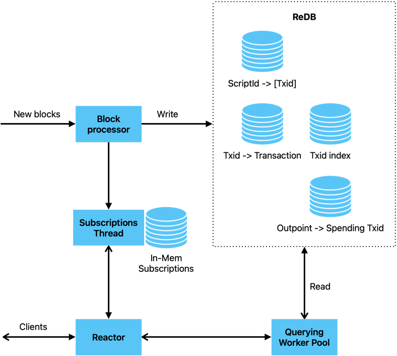

# BP Node

Bitcoin blockchain indexing and wallet notification node. It may be considered Electrum server or
Esplora replacement, being faster, providing modern binary API, supporting wallet descriptors,
LN-specific queries, client-side-validation tech like RGB, modern publication-subscribe interfaces,
Noise encryption in network connectivity, asymmetric cryptographic client authentication and many
more.

The node designed and implemented by [Dr Maxim Orlovsky](https://github.com/dr-orlovsky) as a part
of [LNP/BP Labs](https://github.com/LNP-BP) effort in building the foundation for LNP/BP layer 2 and
3 bitcoin application ecosystem. It is based on other LNP/BP projects such as [BP Core Lib],
[BP Standard Lib], [BP Wallet Lib] and can be easily integrated with the rest of LNP/BP nodes like
[LNP Node].

In the future it is planned to upgrade the node into a fully-validating bitcoin node by using
[`bitcoinkernel`] library for validating blocks.

## Components

This repository contains the following crates:

- `bp-node`: main indexing daemon, which can be used as an embedded multi-thread service, or
  compiled into a standalone binary (`bpd`);
- `bp-client`: client to work with the daemon and a command-line utility `bp-cli`;
- `bp-rpc`: a shared crate between `bp-node` and `bp-client`.

## Node Architecture

The node operates as a set of threads, communicating through Crossbeam channels. It leverages
[`microservices.rs`] and [`netservices.rs`] crates, which serves as the node non-blocking
reactor-based (see [`io-reactor`]) microservice frameworks.

The node daemon has the following components:

- **Broker**, integrating all services and managing their communications;
- **RPC**: reactor-based thread managing incoming client connections, notifying them about changes
  to the subscribed information;
- **Persistence**, an embedded ReDB database;
- **Block importer**: a client connecting an integration service (see below) to bitcoin blockchain
  provider (Bitcoin Core, other Bitcoin nodes or indexers) receiving downloaded and new blocks and
  adding them into the database;
- **Query workers**, thread pool running queries for the client subscriptions in the database.

In order to operate one also needs to provide a node with an interface to bitcoin blocks integrating
it with either Bitcoin Core, or any other node or indexer.

By default, the node exposes a binary RPC API over TCP, which can be exposed as more high-level APIs
(HTTP REST, Websocket-based or JSON-RPC) using special adaptor services.

## OS Support

The project currently supports only Linux and UNIX OSes. Support for macOS is currently broken due
to use of a Rust language unstable feature on macOS platform by one of the project dependencies, and
will be recovered soon. Windows support is a work-in-progress, requiring downstream [`io-reactor`]
framework changes.

[`bitcoinkernel`]: https://github.com/bitcoin/bitcoin/issues/27587

[BP Core Lib]: https://github.com/BP-WG/bp-core

[BP Standard Lib]: https://github.com/BP-WG/bp-std

[BP Wallet Lib]: https://github.com/BP-WG/bp-wallet

[LNP Node]: https://github.com/LNP-WG/lnp-node

[`io-reactor`]: https://github.com/rust-amplify/io-reactor

[`microservices.rs`]: https://github.com/cyphernet-labs/microservices.rs

[`netservices.rs`]: https://github.com/cyphernet-labs/netservices.rs
